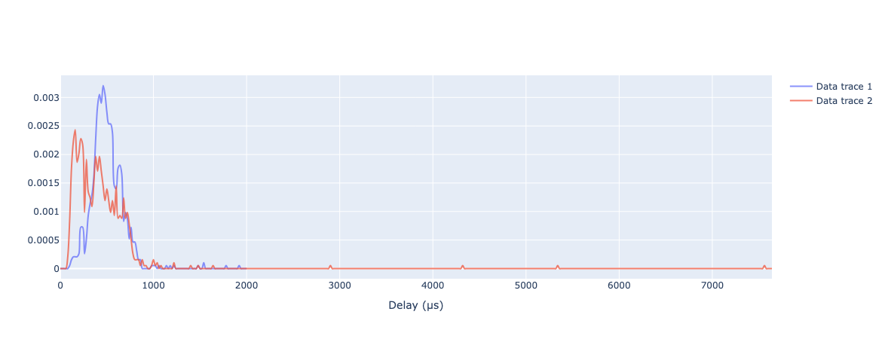

# Latency Analysis of UPF using iperf3 and trace-visualiser

To get the latency analysis of UPF, we need to measure the latency between the packets sent by the UPF and the packets received by the UPF. That is on the N3 and N6 interfaces. When it comes to the implementation, we see that in the isolated case there is lil to no latency. 



The above graph shows the latency between the packets sent by the UPF and the packets received by the UPF. The latency is measured in microseconds. The x-axis represents the time in seconds and the y-axis represents the latency. The one marked in red is under the registration attack. This is because the UPF is not under attack and is not getting any control messages. 


To get the graph, we need to run to do the following steps: 
1. Identify which bridge networks are being used by the VMs. In this case, the bridge networks are `bridge100` and `bridge102`.
2. Start packet capture on both of them simultaneously.
3. Run the iperf3 test with the following command: 
    ```bash
    ./nr-binder 10.45.0.2 iperf3 -c speedtest.uztelecom.uz -u -b 50M       
    ```   
4. Save the packet capture files. 
5. Isolate the packets that are sent by UPF. It'll be easier to isolate the packets, if UDP is used with the iperf command. 
Filters used were: 
    > udp && !tcp && !gtp && !pfcp # For N6 interface
    > gtp && udp && !tcp && !pfcp # For N3 interface
6. Using trace visualiser, run and compute the latency between the packets sent by the UPF and the packets received by the UPF.
7. Plot the graph using the data obtained.
8. Repeat the steps 3-7 for the registration attack.